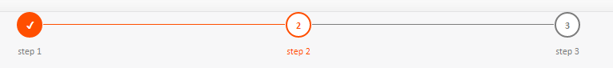

## Stepper Component


### Usage:


````javascript 
import Stepper from 'Stepper';
// status types: [active, completed, ''] 
function myComponent() {
  const steps = [
    {
      label: 'step 1',
      status: 'completed'
    }, 
    {
      label: 'step 2',
      status: 'active'
    },
    {
      label: 'step 3',
      status: ''
    }
  ]

  return (
    <Stepper stepList= {steps}>
  )
}

````




